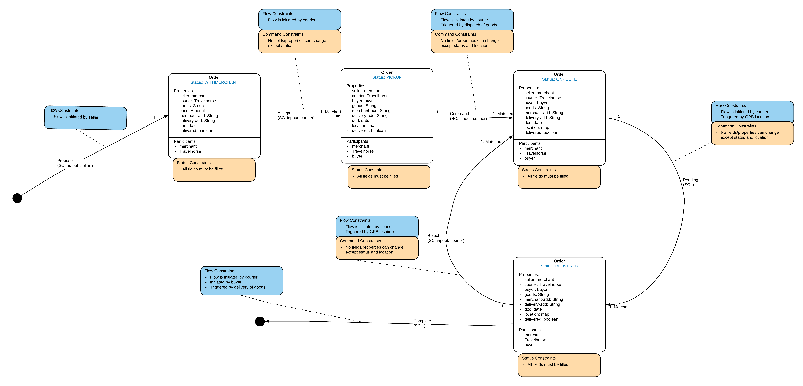

# TH-Cordapp

This cordapp was adapted from the corda java templete found [here](https://github.com/corda/samples-java/tree/master/Accounts/supplychain).

Adaptations were made to fit our business flow smart contract as shown in the diagram below. 

<p align="center">
  
</p>

# Deploying Nodes
## In terminal
```
./gradlew clean deployNodes
cd build/nodes
./runnodes
```

# Creating Accounts
## In Seller's terminal
```
flow start CreateNewAccount acctName: SellerInbox
flow start CreateNewAccount acctName: SellerStock
flow start CreateNewAccount acctName: SellerFinance
```

## In Buyer's terminal
```
flow start CreateNewAccount acctName: BuyerInbox
flow start CreateNewAccount acctName: BuyerFinance
flow start CreateNewAccount acctName: BuyerAddress
```

## In DeliveryCo's terminal
```
flow start CreateNewAccount acctName: CourierInbox
flow start CreateNewAccount acctName: CourierFinance
```

# Sharing Accounts
## In Seller's terminal
```
flow start ShareAccountTo acctNameShared: SellerInbox, shareTo: Buyer
flow start ShareAccountTo acctNameShared: SellerFinance, shareTo: Buyer
flow start ShareAccountTo acctNameShared: SellerStock, shareTo: DeliveryCo
flow start ShareAccountTo acctNameShared: SellerInbox, shareTo: DeliveryCo
flow start ShareAccountTo acctNameShared: SellerFinance, shareTo: DeliveryCo
```

## In Buyer's terminal
```
flow start ShareAccountTo acctNameShared: BuyerFinance, shareTo: Seller
flow start ShareAccountTo acctNameShared: BuyerInbox, shareTo: Seller
flow start ShareAccountTo acctNameShared: BuyerAddress, shareTo: Seller
flow start ShareAccountTo acctNameShared: BuyerInbox, shareTo: DeliveryCo
flow start ShareAccountTo acctNameShared: BuyerAddress, shareTo: DeliveryCo
```

## In DeliveryCo's terminal
```
flow start ShareAccountTo acctNameShared: CourierFinance, shareTo: Seller
flow start ShareAccountTo acctNameShared: CourierInbox, shareTo: Seller
flow start ShareAccountTo acctNameShared: CourierInbox, shareTo: Buyer
```

# Executing Business Flows
## Step 1: Buyer will send Order Message of what he wants through the OrderMesasge flow
```
flow start OrderMessage fromWho: BuyerInbox, whereTo: SellerInbox, order: 'String' 
```

## Step 2: Seller's team will send the order to DeliveryCo's team
Navigate to Seller's node terminal and type in: 
```
flow start OrderMessage fromWho: SellerInbox, whereTo: CourierInbox, order: 'String including contact and delivery details'
```
This is to send a message to the inbox of the delivery company.

Seller will also initiate SendDeliveryRequest flow to the DeliveryCo.
```
flow start SendDeliveryRequest whoAmI: SellerStock, whereTo: BuyerAddress, courier: DeliveryCo, parcel: "String"
```

## Step 3: DeliveryCo will initiate SendParcel flow and deliver the parcel to the Buyer.
Navigate to DeliveryCo's terminal:
```
flow start SendParcel pickupFrom: SellerStock, shipTo: BuyerAddress, parcel: "String", status: "pickedup/onroute/delivered"
```

DeliveryCo will also send Buyer an OrderMessage to update the Buyer on the status of the delivery.
```
flow start SendOrder whoAmI: CourierInbox, whereTo: BuyerInbox, order: 'Status: pickedup/onroute' 
```

## Step 4: When the parcel has been delivered, the DeliveryCo will send an OrderMessage to Buyer and Seller to update the status of delivery as delivered
Navigate to DeliveryCo's terminal:
```
flow start OrderMessage fromWho: CourierInbox, whereTo: BuyerInbox, order: Status- delivered 
flow start OrderMessage fromWho: CourierInbox, whereTo: SellerInbox, order: Status- delivered
```
## Step 5: Seller will initiate SendInvoice to Buyer
Navigate to Seller's terminal:
```
flow start SendInvoice whoAmI: SellerFinance, whereTo: BuyerFinance, amount: "Int"
```

## Step 6: DeliveryCo will initiate SendInvoice to Seller
Navigate to DeliveryCo's terminal:
```
flow start SendInvoice whoAmI: CourierFinance, whereTo: SellerFinance, amount: "Int"
```

## Step 7: Buyer will initiate SendPayment to Seller
Navigate to Buyers's terminal:
```
flow start SendPayment whoAmI: BuyerFinance, whereTo: SellerFinance, amount: "Int"
```

## Step 8: Seller will initiate SendPayment to DeliveryCo
Navigate to Sellers's terminal:
```
flow start SendPayment whoAmI: SellerFinance, whereTo: CourierFinance, amount: "Int"
```

## End of Business flow 


